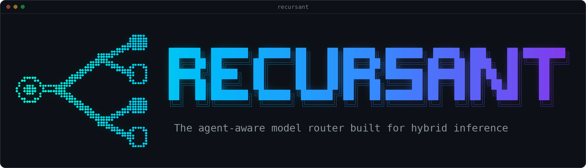

<p align="center">
  
</p>

<p align="center"><b>Cut your AI bill by 30%+, keep personal data private, and seamlessly run agents across private and public inference.</b></p>

Recursant sits between your AI agents and the AI models they use. Every time an agent asks for its next step, Recursant picks who answers: a top model for the hard steps, a cheaper model for the routine ones, and your own private model whenever personal data is involved. Your agent doesn't change. You point it at Recursant instead of at the model provider, and Recursant does the rest.

## What it does

- **Picks a model for every step.** An agent doesn't make one request per job; it makes dozens: read a file, run the tests, read the error, fix it, try again. Most of those steps are routine. Recursant sends routine steps to the cheaper model and keeps the thinking-heavy ones on the main model. If the agent keeps failing, it brings in a stronger model.
- **Doesn't trip the agent up mid-task.** Switching models carelessly can confuse an agent or lose the discount providers give for repeated text. Recursant follows each conversation and only switches where it is safe.
- **Keeps personal data private.** Every request is checked before it leaves your machine. The check covers tax file numbers, Medicare numbers, card numbers, phone numbers, email addresses and any patterns you add. Anything that matches goes to your private model instead, and that conversation stays private from then on. This check is fully deterministic using regexes. We have plans for SLM/ML-driven recognition as well.
- **Works seamlessly across private and public inference** Models on your own GPUs and paid services such as OpenRouter sit in one pool. Your own GPU always handles the private work, and you can let it take routine work as well, which costs nothing per request.
- **Works with the agent you have.** It speaks the same language as OpenAI's API, which almost every agent and tool supports. No plugins and no code changes. It is tested with Hermes and pi, testing with other harnesses are underway, so please bear with us as we optimise.
- **Scales fast.** Recursant is written in C and has minimal dependencies. It is designed to be fast. 

## Support

You need Linux to run Recursant. macOS support is underway, Windows is tricky.

## Install

On Linux or macOS, run:

```sh
curl -fsSL https://raw.githubusercontent.com/ajensenwaud/recursant/main/install.sh | bash
```

This downloads the source code, installs anything needed to build it (through your package manager, so it may ask for your password), builds Recursant, and writes a starter setup. It doesn't start anything and doesn't send anything anywhere. The script is short if you want to [read it first](install.sh).

You end up with:

- the program at `~/.local/bin/recursant`
- your settings in `~/.config/recursant/config.json`
- your keys in `~/.config/recursant/recursant.env`, readable only by you. This includes a key for your agents to use, created for you.

If your shell says `recursant: command not found`, add `~/.local/bin` to your path: `export PATH="$HOME/.local/bin:$PATH"`.

## Set it up

The starter setup uses:

| Name | Model | Used for |
|---|---|---|
| `baseline` | Claude Sonnet 5.5 (via OpenRouter) | the main model for anything not routine |
| `economy` | GPT-6 luna (via OpenRouter) | routine steps and simple questions |
| `strong` | Claude Opus 5.5 (via OpenRouter) | when the agent keeps getting stuck |
| `local` | qwen3:8b on Ollama, on this machine | anything containing personal data |

**1. Add your OpenRouter key.** Recursant asks for it and doesn't show it as you type:

```sh
recursant configure --set-key OPENROUTER_API_KEY
```

**2. Point it at your private model.** The starter setup expects Ollama on this machine. If your private model runs somewhere else, add it and make it the place personal data goes. For example, for a GPU server called `gpu-box`:

```sh
recursant configure --add-provider gpu --url http://gpu-box:8000/v1 --trust private --private-default gpu:my-model-name
```

**3. Check everything.**

```sh
recursant check
```

It tells you in plain words what's missing or wrong.

Prefer menus? Run `recursant configure` on its own for step-by-step setup of model services, models, privacy patterns, network and keys. Every change is checked before it's saved, and your previous settings are kept as a dated backup next to the file.

Other things you can change:

```sh
recursant configure --alias economy=openrouter:openai/gpt-6-luna   # use a different cheap model
recursant configure --add-pattern 'CUST-[0-9]{6}'                  # treat your own IDs as private
recursant configure --listen tailnet                               # reachable from your Tailscale network
recursant configure --list-providers                               # 28 known model services
```

So far Recursant has been tested live with OpenRouter and with models on your own servers (vLLM, Ollama and similar). The other services in the list should work the same way, but haven't been tested against their real systems yet.

## Start it

Run it as a background service in `systemd` that starts with your computer:

```sh
recursant install --user
recursant start
recursant status
```

`status` shows whether it's running, its address, how many requests it has handled, and where they went.

- **For the whole machine:** use `sudo recursant install --system` and `sudo recursant start` instead.
- **To try it first without a service:** run `recursant serve`, and press Ctrl-C to stop it.

## Connect your agent

Your agent needs three settings:

| Setting | Value |
|---|---|
| Address (base URL) | `http://127.0.0.1:8080/v1` |
| Key | `RECURSANT_API_KEY` from `~/.config/recursant/recursant.env` |
| Model | `auto` (let Recursant choose) |

**Hermes:** run `hermes model`, choose *Custom endpoint (enter URL manually)*, and enter the three values above.

**pi:** add Recursant to `~/.pi/agent/models.json`:

```json
{
  "providers": {
    "recursant": {
      "baseUrl": "http://127.0.0.1:8080/v1",
      "api": "openai-completions",
      "apiKey": "${RECURSANT_API_KEY}",
      "models": [{ "id": "auto", "contextWindow": 131072, "maxTokens": 8192 }]
    }
  }
}
```

Then export your key (`export RECURSANT_API_KEY=...`) and run `pi --provider recursant --model auto`.

**Anything else:** wherever the tool asks for an OpenAI address, key and model, enter the values above. To see it working from the command line:

```sh
source ~/.config/recursant/recursant.env
curl -s http://127.0.0.1:8080/v1/chat/completions \
  -H "Authorization: Bearer $RECURSANT_API_KEY" -H 'Content-Type: application/json' \
  -d '{"model":"auto","messages":[{"role":"user","content":"Say hello"}]}' \
  -D - -o /dev/null | grep -i '^x-recursant'
```

Every answer says which model handled it and why (in the `X-Recursant-Model` and `X-Recursant-Decision` headers), so you can always see what happened. To choose a model yourself, ask for `baseline`, `economy`, `strong` or `local` instead of `auto`.

## Commands

| Command | What it does |
|---|---|
| `recursant status` | Is it running, where, and what has it done |
| `recursant check` | Check your settings before restarting |
| `recursant restart` | Load new settings. If they're broken, the running copy carries on untouched |
| `recursant start` / `stop` | Start or stop the service |
| `recursant configure` | Change settings, with menus or the switches above |
| `recursant install` / `uninstall` | Add or remove the background service. `uninstall --purge` also deletes your settings and keys |
| `recursant serve` | Run in this window instead of in the background |

Logs go to the system journal: `journalctl --user -u recursant`, or `sudo journalctl -u recursant` for the whole-machine service. Logs record decisions only, never what your agents wrote.

## How it decides

For every request, Recursant asks four questions in this order:

1. **Is there private data?** If the request contains personal data, or something Recursant can't read and check, it goes to your private model. Nothing later can override this.
2. **Is it safe to switch?** If switching models now could confuse the agent, the request stays where it is.
3. **What just happened?** If the agent's last action worked, the next step is routine and goes to the cheaper model. If it has failed twice in a row, a stronger model takes over. Helper agents start on the cheaper model.
4. **Which allowed model is cheapest?** It weighs prices, how busy each model is, and whether it's working.

Recursant decides all this itself, in a few milliseconds, from the request the agent already sent. There's no second AI model making the call, and no extra service to run.

## Safety

- Keys never go in the settings file. They stay in `recursant.env`, readable only by you.
- If your private model fails, Recursant never falls back to a public one.
- By default it only listens on this machine. Opening it to your network is your choice (`--listen`). If other people will reach it, put it behind a secure proxy.
- The privacy check catches the formats it knows plus your own patterns. It is a strong safety net, not a guarantee that no personal data of any kind can ever leave.

## Results

Answering 980 general-knowledge exam questions (MMLU-Pro), one request each:

| Model | Correct | Cost |
|---|---|---|
| GLM-5.3-Flash on your own GPU | 80.1% | **US$0** |
| GPT-6 luna (cheaper, via OpenRouter) | 84.6% | US$0.15 |
| GPT-6.1 sol (top, via OpenRouter) | 88.3% | US$1.53 |

The top model does better on hard questions, but nothing we tried could tell in advance which questions those are. So for single questions Recursant uses the cheapest model you allow, and the trade-off is your choice ([details](docs/evidence/m3-encoder-classifier.md)). We also tested small "decision models" (Jev, Strands Decider) as advisers. They didn't save money reliably, so they're switched off ([details](docs/m3-decision-model.md)).

## Running it in Docker

```sh
docker build -f deploy/Dockerfile -t recursant:local .
docker run --rm --user "$(id -u):$(id -g)" --read-only --cap-drop ALL --security-opt no-new-privileges \
  -p 127.0.0.1:8080:8080 -v "$HOME/.config/recursant/config.json:/etc/recursant/config.json:ro" \
  --env-file "$HOME/.config/recursant/recursant.env" recursant:local
```

## Status

| Part | State |
|---|---|
| One address for your own models and paid services | Done, tested live |
| Privacy rules: personal data stays on your machines | Done, including Australian ID numbers with check digits |
| Step-by-step model choice for agents | Done: 29–39% cheaper at the same quality in our tests |
| Web console, audit history, tracing | Planned |
